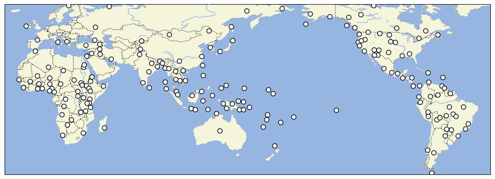

# D-PLACE dataset derived from Murdock and White 1969 'Standard Cross-Cultural Sample'

## How to cite

If you use these data please cite
- the original source
  > Murdock GP & White DR. 1969. Standard Cross-Cultural Sample. Ethnology. 9:329–369.
- the derived dataset using the DOI of the [particular released version](../../releases/) you were using

## Description

This dataset is licensed under a CC-BY-NC-4.0 license

Available online at https://escholarship.org/uc/item/62c5c02n

## CLDF Datasets

The following CLDF datasets are available in [cldf](cldf):

- CLDF [StructureDataset](https://github.com/cldf/cldf/tree/master/modules/StructureDataset) at [cldf/StructureDataset-metadata.json](cldf/StructureDataset-metadata.json)